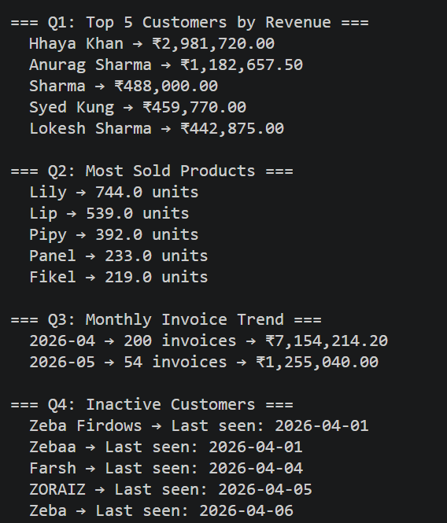

# Invoice-Data-Analytics

A business analytics project built on top of a real SQLite database
from a WhatsApp-based invoice management bot.

## What This Does
Runs four business queries on 254 real invoices and outputs
actionable insights — customer revenue, product performance,
monthly trends, and inactive customer detection.

## Technical Highlights
- Handled nested JSON data inside SQLite BLOB column
- Used Python aggregation where SQL alone was insufficient
- Clean SQL queries documented separately in queries.sql

## Queries
- Top 5 customers by total revenue
- Most sold products by quantity
- Monthly invoice volume and revenue trend
- Customers with no activity in 30+ days

## Stack
Python · SQLite · SQL

## Database
254 invoices · 22 customers · 30 products
Live data from a WhatsApp Invoice Bot
## Output

---
Zeba Firdouse
